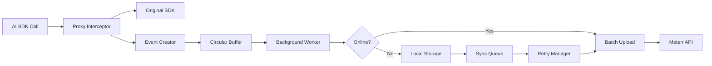

# Meterr.ai SDK Architecture

## Core Components

### 1. **SDK Core Module**
```typescript
// Core tracking interface
interface MeterrCore {
  // Lightweight event buffer with circular queue
  eventBuffer: CircularBuffer<TrackingEvent>
  
  // Background worker for async processing
  worker: BackgroundWorker
  
  // Configuration management
  config: MeterrConfig
  
  // Connection state manager
  connectionManager: ConnectionManager
}
```

### 2. **Provider Wrappers**
```typescript
// Generic wrapper pattern for AI providers
abstract class ProviderWrapper<T> {
  protected original: T
  protected interceptor: RequestInterceptor
  
  // Proxy pattern to intercept calls
  wrap(): T {
    return new Proxy(this.original, {
      get: (target, prop) => {
        if (typeof target[prop] === 'function') {
          return this.interceptor.wrap(target[prop], prop)
        }
        return target[prop]
      }
    })
  }
}

// Specific implementations
class OpenAIWrapper extends ProviderWrapper<OpenAI> {}
class AnthropicWrapper extends ProviderWrapper<Anthropic> {}
```

### 3. **Event Tracking System**
```typescript
interface TrackingEvent {
  id: string              // UUID v4
  timestamp: number       // Unix timestamp
  provider: string        // 'openai' | 'anthropic' | etc
  method: string          // API method called
  request: {
    model?: string
    tokens?: number
    parameters?: Record<string, any>
  }
  response: {
    tokens?: number
    latency: number
    status: 'success' | 'error'
    error?: string
  }
  metadata: {
    teamId?: string
    projectId?: string
    userId?: string
    tags?: string[]
    environment?: string
  }
}
```

### 4. **Storage Layer**
```typescript
interface StorageAdapter {
  // Async write to not block main thread
  write(events: TrackingEvent[]): Promise<void>
  
  // Read for sync operations
  read(since?: number): Promise<TrackingEvent[]>
  
  // Cleanup old events
  prune(before: number): Promise<void>
}

// Implementations
class IndexedDBStorage implements StorageAdapter {} // Browser
class SQLiteStorage implements StorageAdapter {}    // Node.js
class InMemoryStorage implements StorageAdapter {}   // Fallback
```

## Data Flow Architecture



### Key Flow Characteristics:
1. **Zero-blocking**: All tracking happens asynchronously
2. **Batching**: Events are batched every 5 seconds or 100 events
3. **Compression**: Payload compression before transmission
4. **Deduplication**: Client-side event deduplication using IDs

## Integration Approach

### 1. **Drop-in Replacement Pattern**
```typescript
// Before
import OpenAI from 'openai'
const openai = new OpenAI({ apiKey: 'sk-...' })

// After
import { OpenAI } from '@meterr/openai'
const openai = new OpenAI({ 
  apiKey: 'sk-...',
  meterr: {
    apiKey: 'mtr_...',
    teamId: 'team_123',
    projectId: 'proj_456'
  }
})

// Usage remains identical
const completion = await openai.chat.completions.create({
  model: "gpt-4",
  messages: [...]
})
```

### 2. **Universal Wrapper Pattern**
```typescript
// For any AI SDK
import { wrapSDK } from '@meterr/core'
import SomeAISDK from 'some-ai-sdk'

const wrappedSDK = wrapSDK(new SomeAISDK(), {
  provider: 'custom',
  apiKey: 'mtr_...',
  teamId: 'team_123'
})
```

### 3. **Middleware Pattern** (for frameworks)
```typescript
// Express middleware
app.use(meterr.middleware({
  captureHeaders: ['x-user-id', 'x-team-id'],
  autoTag: true
}))

// Next.js wrapper
export default withMeterr(handler, {
  projectId: process.env.PROJECT_ID
})
```

## Security Considerations

### 1. **Data Privacy**
```typescript
class DataSanitizer {
  // Remove sensitive data before tracking
  sanitize(data: any): any {
    const sensitive = ['apiKey', 'password', 'token', 'secret']
    return this.deepClean(data, sensitive)
  }
  
  // Option to hash PII
  hashPII(value: string): string {
    return crypto.createHash('sha256')
      .update(value + this.salt)
      .digest('hex')
  }
}
```

### 2. **API Key Management**
```typescript
class SecureConfig {
  private apiKey: string
  
  constructor(key: string) {
    // Validate key format
    if (!this.isValidKey(key)) {
      throw new Error('Invalid API key format')
    }
    
    // Store encrypted in memory
    this.apiKey = this.encrypt(key)
  }
  
  // Never expose in logs or errors
  toString(): string {
    return 'mtr_***' + this.apiKey.slice(-4)
  }
}
```

### 3. **Network Security**
- **TLS only**: Enforce HTTPS for all API calls
- **Certificate pinning**: Optional cert pinning for enterprise
- **Request signing**: HMAC signatures for request integrity
- **Rate limiting**: Client-side rate limiting to prevent abuse

### 4. **Local Storage Security**
```typescript
class SecureStorage {
  // Encrypt sensitive data at rest
  async write(data: TrackingEvent[]): Promise<void> {
    const encrypted = await this.encrypt(data)
    await this.storage.setItem(this.key, encrypted)
  }
  
  // Automatic cleanup
  async cleanup(): Promise<void> {
    const ttl = 7 * 24 * 60 * 60 * 1000 // 7 days
    await this.pruneOldEvents(Date.now() - ttl)
  }
}
```

## Implementation Priorities

### Phase 1: Core (Week 1-2)
- [ ] Event tracking system
- [ ] Circular buffer implementation
- [ ] Background worker
- [ ] Basic storage adapter

### Phase 2: Providers (Week 3-4)
- [ ] OpenAI wrapper
- [ ] Anthropic wrapper
- [ ] Generic wrapper utility
- [ ] Request/response interceptors

### Phase 3: Reliability (Week 5-6)
- [ ] Offline support
- [ ] Sync queue management
- [ ] Retry logic with exponential backoff
- [ ] Error boundary handling

### Phase 4: Security & Performance (Week 7-8)
- [ ] Data sanitization
- [ ] Encryption layer
- [ ] Performance optimizations
- [ ] Compression algorithms

## Minimal Dependencies

```json
{
  "dependencies": {
    "uuid": "^9.0.0",           // UUID generation
    "idb": "^7.0.0"              // IndexedDB wrapper (browser only)
  },
  "optionalDependencies": {
    "better-sqlite3": "^8.0.0", // Node.js persistent storage
    "pako":