# 🔄 What Your Webhook System Does

## The Complete Flow:

```mermaid
graph LR
    A[Your App] -->|API Call| B[OpenAI/Claude]
    B -->|via| C[Helicone Proxy]
    C -->|Tracks Usage| D[Helicone Dashboard]
    D -->|Sends Webhook| E[ngrok Tunnel]
    E -->|Routes to| F[n8n Workflow]
    F -->|Processes| G[PostgreSQL Database]
    
    style A fill:#e1f5fe
    style C fill:#fff3e0
    style D fill:#f3e5f5
    style E fill:#e8f5e9
    style F fill:#fff9c4
    style G fill:#ffebee
```



## What Happens Step-by-Step:

### 1️⃣ **You Make an API Call**
```javascript
// Your code
await openai.chat.completions.create({
  model: "gpt-4",
  messages: [{role: "user", content: "Hello"}]
})
```
**Cost**: $0.03 for this call

### 2️⃣ **Helicone Intercepts**
- Proxies to OpenAI/Anthropic
- Measures tokens used
- Calculates cost
- Logs the request

### 3️⃣ **Webhook Fires**
```json
{
  "event": "request.created",
  "data": {
    "model": "gpt-4",
    "cost": 0.03,
    "tokens": 150,
    "user_id": "user-123",
    "timestamp": "2025-01-15T20:30:00Z"
  }
}
```

### 4️⃣ **n8n Processes**
Your workflow:
- ✅ Receives webhook
- ✅ Validates data
- ✅ Stores in database
- ✅ Checks if cost > $10 (alerts if true)

### 5️⃣ **Database Stores**
```sql
SELECT * FROM llm_usage;

| id | model  | cost | tokens | user_id  | timestamp           |
|----|--------|------|--------|----------|---------------------|
| 1  | gpt-4  | 0.03 | 150    | user-123 | 2025-01-15 20:30:00 |
| 2  | gpt-4  | 0.05 | 200    | user-456 | 2025-01-15 20:31:00 |
| 3  | claude | 0.02 | 100    | user-123 | 2025-01-15 20:32:00 |
```

## 📊 What You Can Now Do:

### Real-Time Cost Tracking
```sql
-- Today's spending
SELECT SUM(cost) as total_cost 
FROM llm_usage 
WHERE DATE(timestamp) = CURRENT_DATE;
-- Result: $47.83
```

### User Analytics
```sql
-- Top spenders
SELECT user_id, SUM(cost) as total_spent 
FROM llm_usage 
GROUP BY user_id 
ORDER BY total_spent DESC;
```

### Cost Alerts
- If any request > $10 → Slack alert
- Daily budget exceeded → Email notification
- Unusual spike → Dashboard warning

## 💰 Business Value:

| Without This System | With This System |
|-------------------|------------------|
| ❌ No idea how much AI costs | ✅ Track every penny |
| ❌ Surprise $5000 OpenAI bill | ✅ Real-time alerts at $100 |
| ❌ Users abuse API limits | ✅ Per-user cost tracking |
| ❌ Manual cost calculations | ✅ Automated database |
| ❌ No cost optimization | ✅ Find expensive patterns |

## 🎯 Example Dashboard You Could Build:

```
┌─────────────────────────────────────┐
│     AI Cost Dashboard - Today       │
├─────────────────────────────────────┤
│ Total Spent:         $127.43        │
│ Requests:            3,421          │
│ Avg Cost/Request:    $0.037         │
│                                     │
│ By Model:                           │
│ • GPT-4:      $89.12  (70%)        │
│ • GPT-3.5:    $23.41  (18%)        │
│ • Claude:     $14.90  (12%)        │
│                                     │
│ Top Users:                          │
│ 1. user-123:  $45.23               │
│ 2. user-456:  $31.12               │
│ 3. user-789:  $28.90               │
│                                     │
│ ⚠️ Alert: user-123 approaching      │
│    daily limit ($50)                │
└─────────────────────────────────────┘
```

## The Magic: 
**Every API call is automatically tracked without changing your application code!**

Your meterr system now:
1. **Sees** every AI API call
2. **Captures** cost and usage
3. **Stores** in your database
4. **Alerts** on high costs
5. **Enables** cost analytics

All happening automatically in the background! 🚀