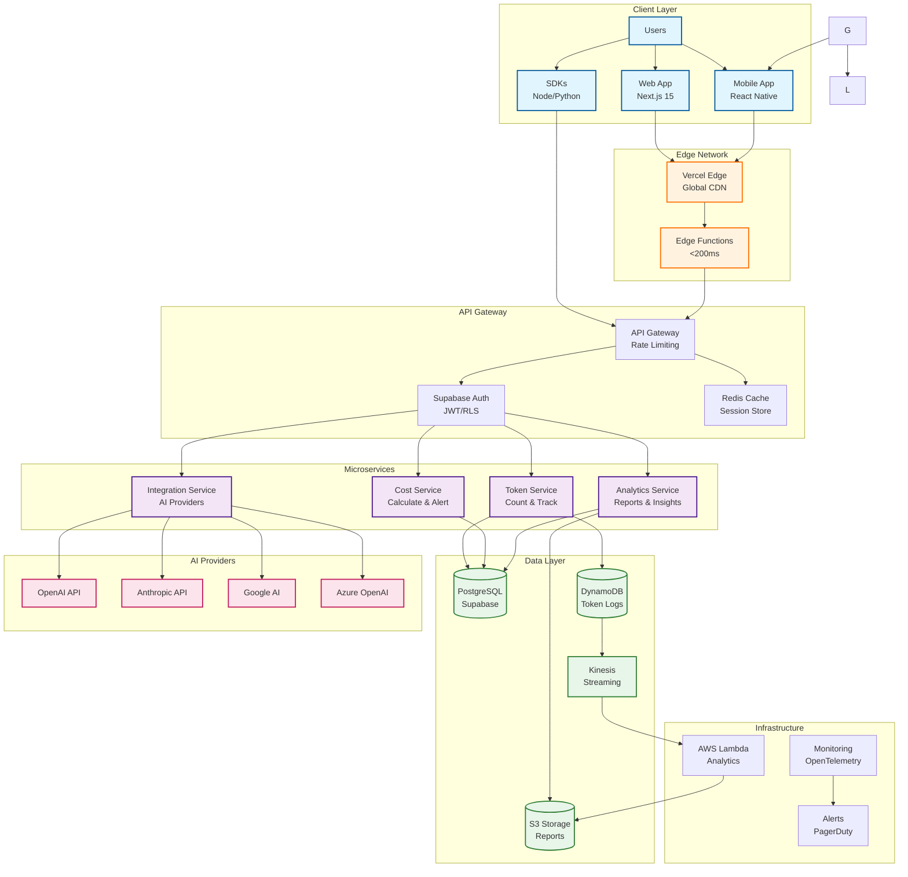

# System Architecture

Meterr.ai is built with a scalable, multi-tenant architecture designed to handle millions of users while maintaining sub-200ms response times and 99.9% uptime.

## Core Architecture Principles

- **Multi-tenancy**: Secure data isolation with shared infrastructure
- **Scalability**: Horizontal scaling to support 1M+ concurrent users
- **Cost Efficiency**: Infrastructure costs under $2/user/month
- **Performance**: Sub-200ms API response times
- **Reliability**: 99.9% uptime SLA

## Architecture Overview

## Technology Stack

### Frontend
- **Framework**: Next.js 15 with App Router
- **Styling**: Tailwind CSS + shadcn/ui
- **State Management**: Zustand
- **Type Safety**: TypeScript

### Backend
- **Database**: Supabase (PostgreSQL)
- **Authentication**: Supabase Auth
- **API**: Next.js API Routes
- **Caching**: Redis
- **File Storage**: S3

### Infrastructure
- **Hosting**: Vercel (Frontend)
- **Database**: Supabase Cloud
- **CDN**: CloudFront
- **Monitoring**: Sentry, LogRocket

## Key Components

### 1. Token Tracking Engine
Accurate real-time tracking of AI token usage across all providers with 99.9% accuracy.

### 2. Cost Optimization Algorithm
Intelligent routing and caching to achieve 40% cost savings.

### 3. Multi-Provider Proxy
Unified API interface for all AI providers with automatic failover.

### 4. Budget Alert System
Real-time notifications when approaching budget limits.

## Detailed Documentation

For the complete technical architecture documentation, see [technical details](./architecture/technical-details.md).

## Related Documentation

- [API Reference](./api/overview)
- [Deployment Guide](./deployment-guide.md)
- [Security Overview](./security-checklist.md)
- [Scaling Guide](./SCALING)
- [Development Guide](./development-guide.md)