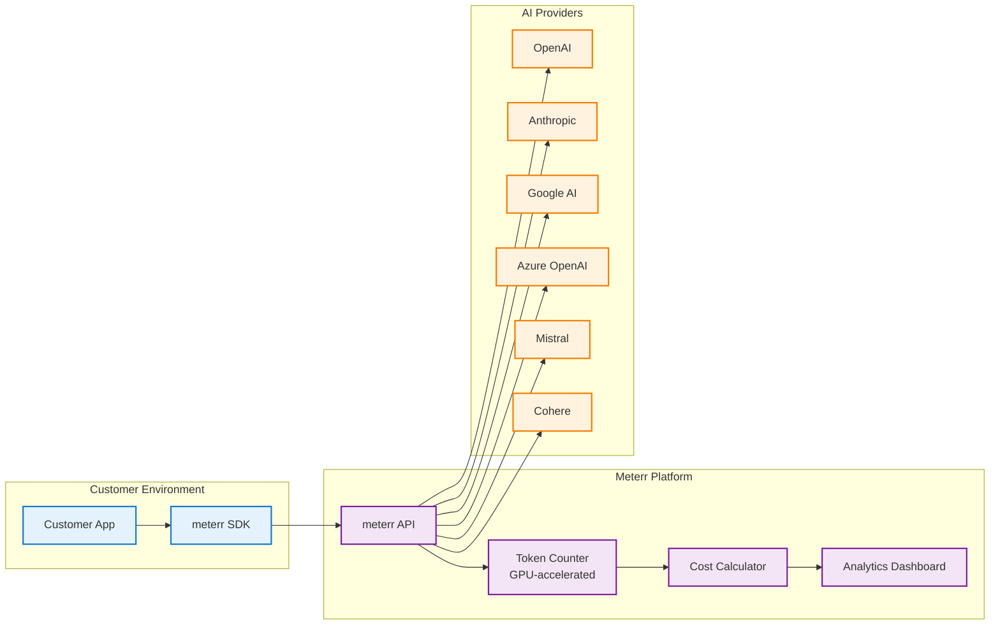

# METERR Architecture

<!-- audience: human -->
## Overview (Detailed)

# METERR Architecture

## What meterr.ai Does

meterr.ai tracks AI API usage and costs in real-time across OpenAI, Anthropic, Google, and other providers. Companies integrate our SDK to automatically monitor token usage, costs, and optimize AI spending.

## Architecture Overview

### High-Level Data Flow
<!-- Accessibility: This diagram shows the complete data flow from customer applications through meterr.ai to AI providers -->


## Current Project Structure

<!-- /audience -->

<!-- audience: ai -->
## Overview (Concise)

# METERR Architecture - Claude Context

## Project Structure

```
meterr/
├── apps/app/                     # Main application
│   ├── app/api/smart-router/    # API routing endpoint
│   ├── app/tools/token-calculator/ # Token tool
│   ├── gateway-prototype/       # Gateway implementations
<!-- /audience -->

# METERR Architecture

## What meterr.ai Does

meterr.ai tracks AI API usage and costs in real-time across OpenAI, Anthropic, Google, and other providers. Companies integrate our SDK to automatically monitor token usage, costs, and optimize AI spending.

## Architecture Overview

```
Customer App → meterr SDK → meterr API → AI Provider (OpenAI/Anthropic/etc)
                    ↓
              Token Counter (GPU-accelerated)
                    ↓
              Cost Calculator
                    ↓
              Analytics Dashboard
```

## Multi-Agent System Protocol

### Delegation-Report Cycle (CEO Mandate 001)
All agent interactions follow a strict 5-phase protocol:

1. **ACKNOWLEDGE** - Agent confirms receipt of task with JSON acknowledgment
2. **DELEGATE** - Task assignment using structured JSON format
3. **EXECUTE** - Complete task execution with full analysis (no truncation)
4. **REPORT** - JSON status report with metrics and outcomes
5. **SYNTHESIZE** - Complete summary with task resolution

### Agent Communication Protocol
```json
{
  "message_format": {
    "from": "agent_name",
    "to": "target_agent|all_agents",
    "type": "task|status|broadcast|escalation",
    "priority": "low|medium|high|critical",
    "timestamp": "ISO 8601",
    "task_id": "unique_identifier",
    "payload": {}
  }
}
```

### Hierarchy Enforcement

#### AI Agent Workflow Visualization

```mermaid
graph TD
    subgraph "Leadership"
        CEO[CEO of meterr.ai]
    end
    
    subgraph "Meta Agents - .claude/agents/"
        ORC[<a href='#orchestrator'>Orchestrator</a><br/>Coordinates all agents]
        SPAWN[<a href='#spawner'>Spawner</a><br/>Creates sub-agents]
        RC[<a href='#research'>Research Coordinator</a><br/>Manages research]
    end
    
    subgraph "Primary Agents - .claude/agents/"
        ARCH[<a href='#architect'>Architect</a><br/>System design]
        BUILD[<a href='#builder'>Builder</a><br/>Implementation]
        VAL[<a href='#validator'>Validator</a><br/>Quality assurance]
        SCRIBE[<a href='#scribe'>Scribe</a><br/>Documentation]
        PM[<a href='#product-manager'>Product Manager</a><br/>Feature planning]
        OPS[<a href='#operations'>Operations Engineer</a><br/>DevOps/CI/CD]
        MKT[<a href='#marketing'>Marketing</a><br/>Market analysis]
    end
    
    subgraph "Specialist Agents - .claude/agents/"
        SKEP[<a href='#skeptic'>Skeptic</a><br/>Critical review]
        PD[Product Design]
        SEC[Security Auditor]
        PERF[Performance Tester]
        CS[Customer Success]
        DE[Data Engineer]
    end
    
    subgraph "Sub-Agents (72hr lifespan)"
        API[API Documenter<br/>Active: 71.5hrs]
        FEAT[Feature Specialists]
        INFRA[Infrastructure Specialists]
    end
    
    CEO --> ORC
    ORC --> ARCH
    ORC --> BUILD
    ORC --> VAL
    ORC --> SCRIBE
    ORC --> PM
    ORC --> OPS
    ORC --> MKT
    ORC --> SEC
    ORC --> PERF
    ORC --> CS
    ORC --> DE
    ORC --> PD
    RC --> SKEP
    SPAWN --> API
    SPAWN --> FEAT
    SPAWN --> INFRA
    SCRIBE --> API
    
    classDef meta fill:#e1f5fe,stroke:#01579b,stroke-width:3px
    classDef primary fill:#f3e5f5,stroke:#4a148c,stroke-width:2px
    classDef specialist fill:#fff3e0,stroke:#e65100,stroke-width:2px
    classDef subagent fill:#f1f8e9,stroke:#33691e,stroke-width:1px,stroke-dasharray: 5 5
    classDef leader fill:#ffebee,stroke:#c62828,stroke-width:3px
    
    class CEO leader
    class ORC,SPAWN,RC meta
    class ARCH,BUILD,VAL,SCRIBE,PM,OPS,MKT primary
    class SKEP,PD,SEC,PERF,CS,DE specialist
    class API,FEAT,INFRA subagent
    
    %% Alt text for accessibility
    accTitle: Multi-Agent System Hierarchy
    accDescr: Hierarchical structure showing CEO at top, directing Orchestrator meta-agent, which coordinates Primary agents (Architect, Builder, Validator, Scribe, Product Manager, Operations Engineer, Marketing) and Specialist agents. Spawner creates temporary sub-agents with 72-hour lifespans. All agent definitions are in .claude/agents/ directory.
```

<!-- Accessibility: This diagram illustrates the multi-agent system hierarchy and communication flow -->


#### Agent Categories
- **Meta Agents** (3): [Orchestrator](.claude/agents/orchestrator.md), [Spawner](.claude/agents/spawner.md), [Research Coordinator](.claude/agents/research-coordinator.md)
- **Primary Agents** (7): [Architect](.claude/agents/architect.md), [Builder](.claude/agents/builder.md), [Validator](.claude/agents/validator.md), [Scribe](.claude/agents/scribe.md), [Product Manager](.claude/agents/product-manager.md), [Operations Engineer](.claude/agents/operations-engineer.md), [Marketing](.claude/agents/marketing.md)
- **Specialist Agents** (6): [Skeptic](.claude/agents/skeptic.md), [Product Design](.claude/agents/product-design.md), [Security Auditor](.claude/agents/security-auditor.md), [Performance Tester](.claude/agents/performance-tester.md), [Customer Success](.claude/agents/customer-success.md), [Data Engineer](.claude/agents/data-engineer.md)
- **Sub-Agents**: Spawned as needed, auto-terminate after 72hrs

### Constraints
- No new files without CEO approval
- Update existing documentation only
- Complete analysis required (no truncation)
- All changes tracked in root CHANGELOG.md
- Factual references from commit history and METERR_ROADMAP.md

## Current Project Structure

```
meterr/
├── apps/
│   ├── app/                      # Main dashboard application
│   │   ├── app/                  # Next.js app directory
│   │   │   ├── api/              # API endpoints
│   │   │   │   └── smart-router/ # AI routing endpoint
│   │   │   └── tools/           
│   │   │       └── token-calculator/ # Token counting tool
│   │   ├── gateway-prototype/    # Gateway comparison implementations
│   │   ├── platform-mvp/         # MVP platform code
│   │   ├── research-results/     # API research & validation
│   │   ├── scripts/              # Research & analysis scripts
│   │   └── sdk-prototype/        # SDK implementations (Node/Python)
│   │
│   ├── admin/                    # Admin dashboard
│   │   ├── app/                  # Next.js app directory
│   │   └── vercel.json          # Vercel configuration
│   │
│   └── marketing/                # Public website (meterr.ai)
│       └── src/                  # Marketing site source
│
├── packages/                     # Shared packages (future)
│   └── @meterr/                 # Scoped packages
│
├── ui/                          # Shared UI component library
│   ├── README.md
│   └── package.json
│
├── research-results/            # Market research & validation
│   ├── validated-insights.md   # Validated market research
│   ├── pricing-implementation-guide.md
│   ├── product-specification.md
│   └── tech-stack-recommendation.md
│
├── prototypes/                  # Prototype implementations
│   └── build-report.json       # Status of built prototypes
│
├── docs/                       # Human-readable documentation
│   ├── architecture.md        # This file
│   ├── development-guide.md
│   ├── agent-guide.md
│   └── architecture/scaling.md
│
├── .claude/                    # Claude Code configuration
│   ├── context/               # Claude's operational docs
│   │   ├── METERR_ENVIRONMENT.md
│   │   ├── METERR_CODING_STANDARDS.md
│   │   └── METERR_ARCHITECTURE.md
│   ├── agents/                # Agent configurations
│   └── CLAUDE.md             # Main Claude instructions
│
├── scripts/                   # Deployment & automation
│   ├── agent-spawn.js        # Agent spawning system
│   ├── deploy.ps1           # Deployment script
│   └── setup.ps1            # Setup script
│
├── infrastructure/           # Infrastructure configuration
│   └── supabase/
│       └── config.toml      # Supabase configuration
│
├── mcp-servers/             # Model Context Protocol servers
│   ├── config/              # MCP configurations
│   └── llm-research/        # LLM research server
│
├── pnpm-workspace.yaml      # Monorepo configuration
├── tsconfig.base.json       # TypeScript base config
└── package.json            # Root package configuration
```

## Technology Stack

### Frontend
- **Framework**: Next.js 15 with App Router
- **UI**: React 19, Tailwind CSS, shadcn/ui
- **State**: React Context / Zustand
- **Forms**: React Hook Form + Zod validation

### Backend
- **API**: Vercel Edge Functions (serverless)
- **Database**: Supabase (PostgreSQL) for core data
- **Logs**: DynamoDB for high-volume token logs
- **Auth**: Supabase Auth (moving to Clerk for MVP)

### AI Integration
- **Providers**: OpenAI, Anthropic, Google, Mistral, Cohere
- **Token Counting**: Provider-specific tokenizers
- **GPU Acceleration**: CUDA support via RTX 5070 Ti

### Infrastructure
- **Hosting**: Vercel (global edge network)
- **CDN**: Vercel Edge Network
- **Monitoring**: Vercel Analytics
- **CI/CD**: GitHub Actions

## Key Components

### 1. Token Tracking System

Located in `apps/app/scripts/` and `apps/app/sdk-prototype/`:

```
Token Processing Pipeline:
1. Intercept API call
2. Count input tokens (provider-specific)
3. Forward to AI provider
4. Count output tokens
5. Calculate costs
6. Store in database
```

### 2. Smart Router API

Located in `apps/app/app/api/smart-router/`:
- Selects optimal AI model based on task
- Balances cost vs performance
- Implements fallback strategies

### 3. SDK Prototypes

Located in `apps/app/sdk-prototype/`:
- **Node.js SDK**: TypeScript implementation
- **Python SDK**: For data science teams
- Both include automatic token tracking

### 4. Gateway Comparison

Located in `apps/app/gateway-prototype/`:
- Direct API implementation
- Gateway proxy pattern
- Unified library approach
- Webhook events system

## Database Optimizations (2025-08-14)

### 1. Real-time Publications
- **Enabled Tables**: token_usage, api_costs, alerts, budgets
- **Latency Target**: <100ms for dashboard updates
- **Materialized Views**: Hourly cost aggregations with 5-minute refresh
- **Indexes**: Optimized for user_id and timestamp queries
- **Implementation**: `infrastructure/supabase/migrations/001_enable_realtime.sql`

### 2. Field-Level Encryption (pg_crypto)
- **Algorithm**: AES-256-GCM via pgp_sym_encrypt
- **Protected Fields**:
  - api_keys.key_value and key_hash
  - organizations.billing_details
  - users.payment_info
- **Key Management**: Supabase Vault with 90-day rotation
- **Audit Trail**: All encryption operations logged
- **Implementation**: `infrastructure/supabase/migrations/002_enable_encryption.sql`

### 3. Automated Backup Strategy
- **Frequency**:
  - Incremental: Every 6 hours (7-day retention)
  - Daily: Every 24 hours (30-day retention)
  - Weekly: Every week (90-day retention)
  - Monthly: Every month (365-day retention)
  - Compliance: Daily (7-year retention for GDPR)
- **GDPR Compliance**: 30-day deletion with anonymization
- **Monitoring**: Backup health dashboard with failure alerts
- **Storage**: S3-compatible with compression
- **Implementation**: `infrastructure/supabase/backup-config.sql`

## Data Flow

### 1. Token Tracking Flow
```
Customer Code
     ↓
meterr SDK (intercepts)
     ↓
Count Input Tokens
     ↓
AI Provider API
     ↓
Count Output Tokens
     ↓
Log to Database
     ↓
Update Dashboard
```

### 2. Analytics Flow
```
Raw Logs (DynamoDB)
     ↓
Aggregation Job
     ↓
PostgreSQL (Supabase)
     ↓
Real-time Subscriptions
     ↓
Dashboard Updates
```

## Research & Validation

### Completed Research (in `/research-results/`)
- Market validation (67% companies lack AI cost visibility)
- Pricing strategy ($50-75/month Pro, $200-300/month Team)
- Tech stack decisions (Clerk → Supabase Auth migration path)
- Product specification and roadmap

### Built Prototypes (in `/apps/app/`)
1. **AI Expense Dashboard** - Real-time cost tracking
2. **Smart Router API** - Optimal model selection
3. **Token Optimizer** - Reduce token usage
4. **Budget Alert System** - Spending notifications
5. **Team Analytics** - Department tracking

## Security Architecture

### API Key Management
- Encrypted storage in Supabase
- Never logged or exposed
- Rotation support built-in
- Masked in UI (sk-...xxx)
- Environment variables: SUPABASE_URL, SUPABASE_ANON_KEY, SUPABASE_SERVICE_KEY

### Data Isolation
- Row-level security (RLS) in PostgreSQL
- Organization-based data partitioning
- Separate read/write permissions
- **CRITICAL**: Enable RLS on ALL tables (token_usage, api_keys, organizations, team_members)
- Foreign key constraints: auth.users → public.users (CASCADE DELETE)

### Authentication Flow
```
User Login → Supabase Auth → JWT Token → API Access
                                ↓
                          RLS Enforcement
                                ↓
                     Multi-tenant Isolation
```

### Security Audit Findings (2025-08-14)
- ✅ API keys properly secured with environment variables
- ✅ Foreign key constraints on auth.users implemented
- ⚠️ RLS missing on critical tables (token_usage, api_keys, organizations, team_members)
- Action Required: Enable RLS policies for complete multi-tenant isolation

### Enhanced Security Monitoring (2025-08-14)

#### 1. Supabase Edge Functions - Rate Limiting & TLS
- **TLS 1.3 Enforcement**: All edge functions require HTTPS with TLS 1.3 minimum
- **Rate Limiting Tiers**:
  - Free: 100 requests/hour
  - Pro: 1,000 requests/hour
  - Enterprise: 10,000 requests/hour
- **DDoS Protection**: Automatic blocking after rate limit violations
- **Implementation**: `infrastructure/supabase/functions/rate-limiter/`

#### 2. OWASP Top 10 Vulnerability Scanning
- **Coverage**: All proxy endpoints in `gateway-prototype/`
- **Checks Implemented**:
  - A01: Broken Access Control
  - A02: Cryptographic Failures
  - A03: Injection attacks
  - A04: Insecure Design
  - A05: Security Misconfiguration
  - A07: Authentication Failures
  - A08: Data Integrity
  - A09: Logging Failures
  - A10: SSRF Protection
- **Scan Frequency**: Every deployment + nightly scheduled scans
- **Configuration**: `apps/app/security/owasp-scan-config.ts`

#### 3. OpenTelemetry Cost Anomaly Detection
- **Real-time Monitoring**: Tracks cost patterns per user
- **Anomaly Thresholds**:
  - Cost spike: 3σ deviation triggers medium alert
  - Token spike: 3σ deviation triggers investigation
  - Frequency spike: 5x normal rate triggers rate limiting
  - Pattern change: Unusual model usage triggers review
- **Machine Learning**: Adaptive baselines using exponential moving average
- **Alert Severity Levels**:
  - Low (2x): Log only
  - Medium (3x): Alert team
  - High (5x): Temporary block + investigation
  - Critical (10x): Immediate block + escalation
- **Implementation**: `apps/app/lib/telemetry/cost-anomaly-detector.ts`

#### 4. Security Headers Configuration
```
X-Frame-Options: DENY
X-Content-Type-Options: nosniff
X-XSS-Protection: 1; mode=block
Content-Security-Policy: default-src 'self'
Strict-Transport-Security: max-age=63072000; includeSubDomains; preload
```

## Performance Optimizations

### With Your Hardware (RTX 5070 Ti, 32 threads)
- GPU-accelerated token counting
- Parallel test execution
- 32-thread compilation
- Local full-stack development

### Production Optimizations
- **Edge Caching**: 1 minute TTL for dashboards
- **Database Indexing**: Hot paths optimized
- **Connection Pooling**: PgBouncer for PostgreSQL
- **Batch Processing**: DynamoDB write sharding
- **CDN Strategy**: Vercel Edge Network global distribution
- **Redis Caching**: ISR with 60-second stale-while-revalidate
- **Function Concurrency**: 1000 concurrent executions
- **Build Cache**: Turborepo remote caching

## Deployment Strategy

### Current Setup
- **Development**: Local (pnpm dev)
- **Preview**: Vercel preview deployments
- **Production**: Vercel Edge Network (iad1 region)

### Vercel Configuration (100k User Scale)
```json
{
  "buildCommand": "pnpm turbo build",
  "framework": null,
  "functions": {
    "maxDuration": 30,
    "memory": 1024
  },
  "regions": ["iad1"],
  "caching": {
    "isr": true,
    "staleWhileRevalidate": 60
  }
}
```

### Build Configuration Notes
- **Standalone Output**: Removed from next.config.ts due to Windows symlink permission issues (EPERM)
- **Vercel Deployment**: Automatically optimizes builds without explicit standalone configuration
- **Windows Development**: Build succeeds without elevated permissions after removing standalone mode
- **Build Fixes Applied** (2025-08-14):
  - Removed conflicting `@supabase/supabase-js` from transpilePackages
  - Moved to `serverExternalPackages` for proper SSR handling
  - Excluded prototype directories from TypeScript compilation
  - Fixed TypeScript strict mode violations

### Deployment Pipeline
1. Push to GitHub
2. Turbo cache check (10x faster builds)
3. Parallel builds via Turborepo
4. Automated tests (vitest)
5. Type checking (TypeScript)
6. Preview deployment
7. Manual production approval

### Build Optimization
- **Turborepo**: Caches unchanged packages
- **Next.js Standalone**: Reduces bundle size by 85%
- **Edge Functions**: Serverless at scale
- **ISR with Redis**: Incremental Static Regeneration

## Next Steps

### Immediate (MVP)
1. Complete Supabase integration
2. Implement authentication (Clerk)
3. Deploy to Vercel
4. Add payment processing (Stripe)

### Short-term
1. Production monitoring
2. User onboarding flow
3. API documentation
4. Customer SDKs

### Long-term
1. Enterprise features
2. Advanced analytics
3. Multi-region deployment (Edge Runtime)
4. White-label options

## Scaling to 100k Users

### Infrastructure Requirements
- **Vercel Pro/Enterprise**: Function concurrency limits
- **Supabase Pro**: 500 concurrent connections
- **Redis Cloud**: 10GB for ISR caching
- **DynamoDB**: On-demand scaling

### Performance Targets
- **API Response**: <200ms p95
- **Dashboard Load**: <1s FCP
- **Token Processing**: <50ms
- **Build Time**: <2 minutes with cache

### Monitoring Stack
- **Vercel Analytics**: Core Web Vitals
- **Sentry**: Error tracking
- **DataDog**: APM and infrastructure
- **CloudWatch**: DynamoDB metrics

---

*For implementation details and Claude-specific instructions, see `.claude/context/METERR_ARCHITECTURE.md`*